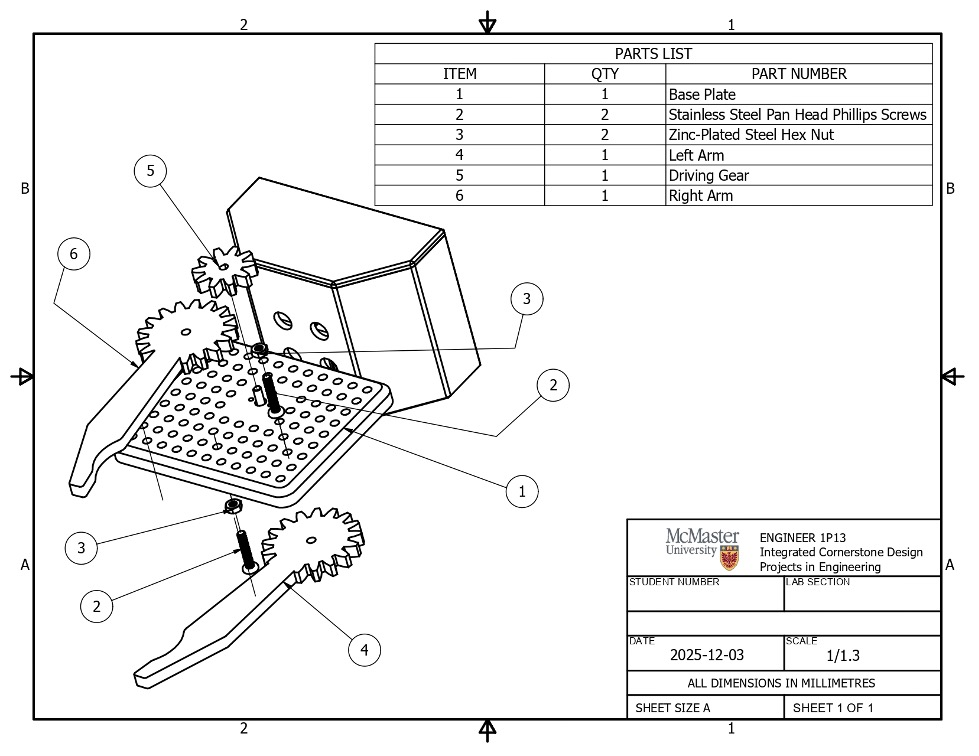

# Robotic End Effector System

## Overview
Team based engineering project to design a warehouse robotic end effector integrating
mechanical design and Python based order management software.

(final_gripper.jpg)

## Demo Video
[▶ Watch system demonstration](https://link_here)

## Mechanical Design

## My Contributions
- Developed Python functions for user authentication and order processing
- Integrated individual modules into a main program and debugged runtime errors
- Contributed to mechanical design iterations of the end effector using CAD and 3D printing

## Technologies
Python, Autodesk Inventor, GitHub

## What I Learned
- Integrating software and hardware systems
- Debugging control flow and data handling issues
- Working in an engineering team environment
